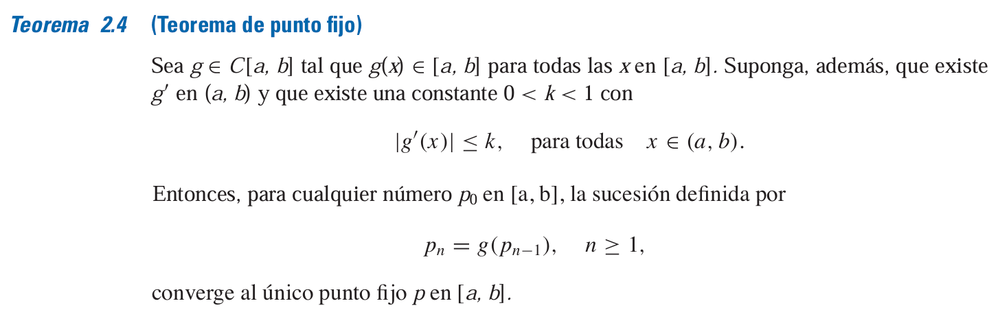
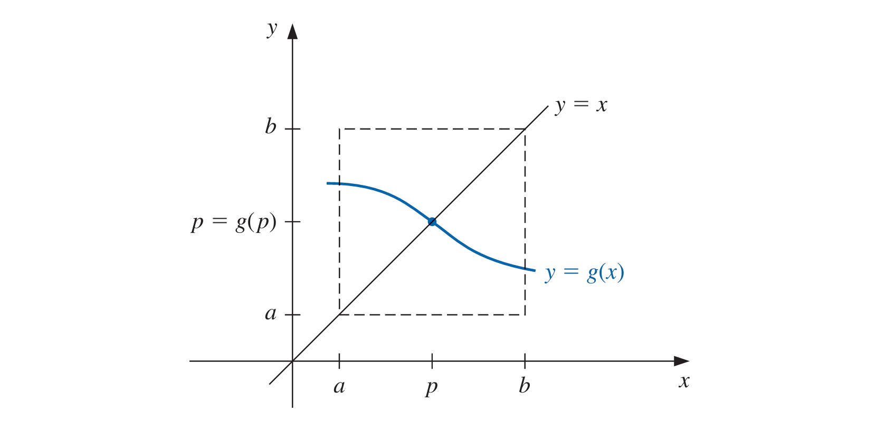
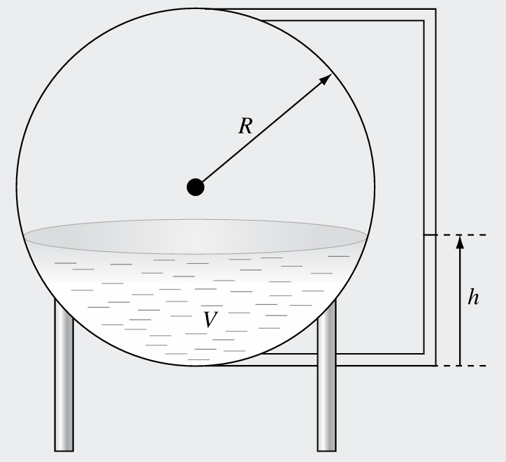
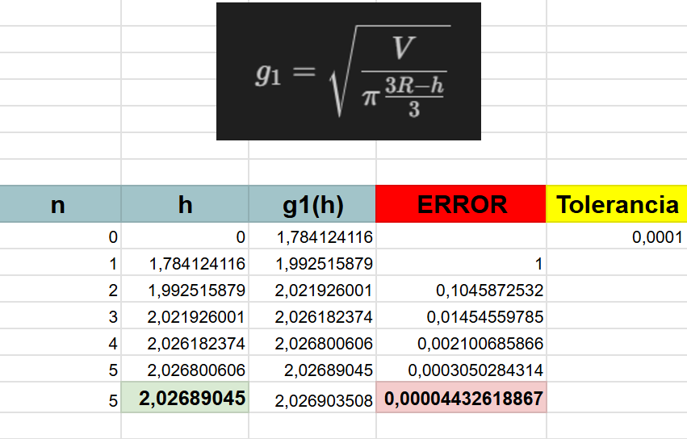
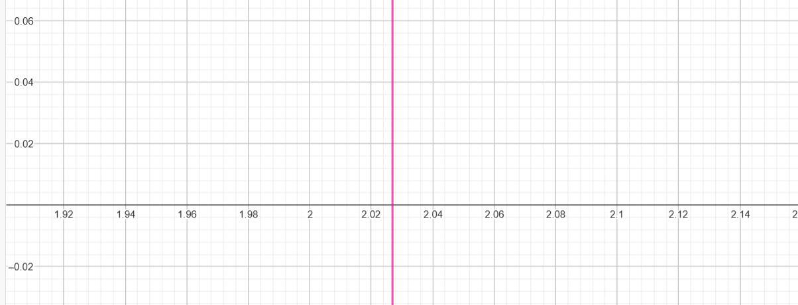

# METODO DE PUNTO FIJO

$$f(x) = x - g(x) = 0$$

## Definición:

El número $p$ es un punto fijo para una función dada $g$ si $g(p)=p$.

El siguiente teorema y su corolario, proporcionan algunas claves respecto a los procedimientos que se deberá seguir.

## Teorema de punto fijo:

## Aplicación

Se está diseñando un tanque esférico de almacenamiento de agua para un poblado pequeño de un país en desarrollo. El volumen del líquido que puede contener se calcula con la siguiente formula:

$$V = \pi h^2\frac{3R-h}{3}$$

donde:

$V = \text{volumen } [m^3]$

$h = \text{profundidad del agua en el tanque }[m]$

$R = \text{radio del tanque } [m]$.

Si $R = 3m$

¿A qué profundidad debe llenarse el tanque de modo que contenga $30m^3$ de agua?

### Solución:

Primeramente se iguala la función $V(h)$ a 0:

$$\pi h^2\frac{3R-h}{3} - V = 0$$

Luego cambiar la ecuación para la forma de punto fijo $h = g(h)$:

* Primer despeje:

$$\pi h^2\frac{3R-h}{3} - V = 0$$

$$h^2 = \frac{V}{\pi\frac{3R-h}{3}}$$

$$h = \pm\sqrt{\frac{V}{\pi\frac{3R-h}{3}}}$$

como se requiere el valor positivo de $h$, se tiene:

$$g_1 = \sqrt{\frac{V}{\pi\frac{3R-h}{3}}}$$

* Segundo despeje:

$$\pi h^2\frac{3R-h}{3} - V = 0$$

$$3R-h = \frac{3V}{\pi h^2}$$

$$g_2 = 3R-\frac{3V}{\pi h^2}$$

Luego, verificamos que algúna de estas expreciones cumpla con los requisitos mencionados en el **Teorema de punto fijo**.

Tomamos un intervalo de $[0, 6]$, ya que $h$ tendrá una altrua mínima y máxima de $0m$ y $6m$ respectivamente. Esto según el gráfico y la infromación que se tienen del radio de la esfera; que son $3m$, luego el diametro de la esfera será de $6m$.

* Para la primera ecuación $g_1$

$$g_1\in C[0,6]$$

luego:

para $h = 0$

$$g_1(0) = \sqrt{\frac{V}{\pi\frac{3R-h}{3}}}$$

$$g_1(0) = \sqrt{\frac{30}{\pi\frac{3(3)-0}{3}}}$$

$$g_1(0) = \sqrt{\frac{30}{3\pi}}$$

$$g_1(0) = \sqrt{\frac{10}{\pi}}\simeq1.78$$

para $h = 6$

$$h_1(6) = \sqrt{\frac{30}{\pi\frac{3(3)-6}{3}}}$$

$$h_1(6) = \sqrt{\frac{30}{\pi}}\simeq3.09$$

Así, entonces se comprueba que $g(h)\in[0,6]$ para todas las h en $[0,6]$

luego, derivamos $g_1$ para verificar que:
$$|g_1'(h)|\leq k, \quad 0<k\le 1;\quad\text{para todas las } h\in [0, 6]$$

entonces:

$$g'(h)=\frac{\sqrt{3} \, V}{2 \sqrt{\pi} \sqrt{\frac{V}{3R - h}} \left(3R - h\right)^{2}}$$

$$g'(0)=\frac{\sqrt{3} \, 30}{2 \sqrt{\pi} \sqrt{\frac{30}{3(3) - 0}} \left[3(3) - 0\right]^{2}}$$

$$g'(0)=\frac{\sqrt{3} \, 30}{2 \sqrt{\pi} \sqrt{\frac{10}{3}} \left(9\right)^{2}}\simeq0.099$$

luego:

$$g'(6)=\frac{\sqrt{3} \, 30}{2 \sqrt{\pi} \sqrt{\frac{30}{3(3) - 6}} \left[3(3) - 6\right]^{2}}$$

$$g'(6)=\frac{\sqrt{3} \, 30}{2 \sqrt{10\pi}(9)}\simeq0.515$$

Así, entonces se verifica que:

$$|g_1'(h)|\leq k, \quad 0<k\le 1;\quad\text{para todas las } h\in [0, 6]$$

Por lo tanto según el **Teorema de punto fijo** se confirma la convergencia para $g_1(h)$.

De esta forma ya no es necesario verificar la convergencia para $g_2(h)$, entonces se procede a encontrar este punto con $g_1(h)$.

#### Método iterativo de punto fijo

No es posible determinar explicitamente el punto fijo para g_1(h). Sin embargo, se puede determinar las aproximaciones para este punto fijo con cualquier grado especifico de precisión.

Al ser un método abierto, se requiere unicamente un valor de inicio $h$. Para aproximar el punto fijo de una función $g$ se elige una aproximación inicial $h_0$, y se genéra una sucesión de la forma $h_n=g_1(h_{n-1})$ para cada $n\ge 1$, y se obtiene una solución para $h = g_1(h)$.

Con ayuda de una hoja de cálculo se procede a realizar el método iterativo de **punto fijo**.

con un valor inicial $h_0 = 0$ y una tolerancia de $0.0001$, para la tolerancia se tomará el error aproximado, que se define como:

$$E_a = \frac{aproximación actual-aproximación anterior}{aproximación actual}$$

De esta forma se obtiene los siguientes resultados:

donde la altura $h$ toma un valor aproximado de $2.03 [m]$.

haciendo uso de un graficador en linea se puede ver que la fúnción interseca con el eje $x$ cerca del valor hallado.

#### Interpretación de los resultados

En base a los resultados, la profundidad del agua en el tanque esfereico debe ser de aproximadamente $2.03m$ para albergar $30m^3$ de agua.

# Conclusión

Muchas ecuaciones que se encuentran en la práctica no tienen soluciones analíticas faciles de encontrar, y por esa razón se usan métodos como el de **punto fijo**; que nos permite hallar un valor aproximado de las raices, para este tipo de ecuaciones.

# REFERENCIAS

Steven C. Chapra, Rymond P. Canale (2015). MÉTODOS NUMÉRICOS (7ma ed.). (p. 47, 113, 114).

Richard L. Burden (2016). ANÁLISIS NUMÉRICO (10ma ed.). (p. 41, 47).